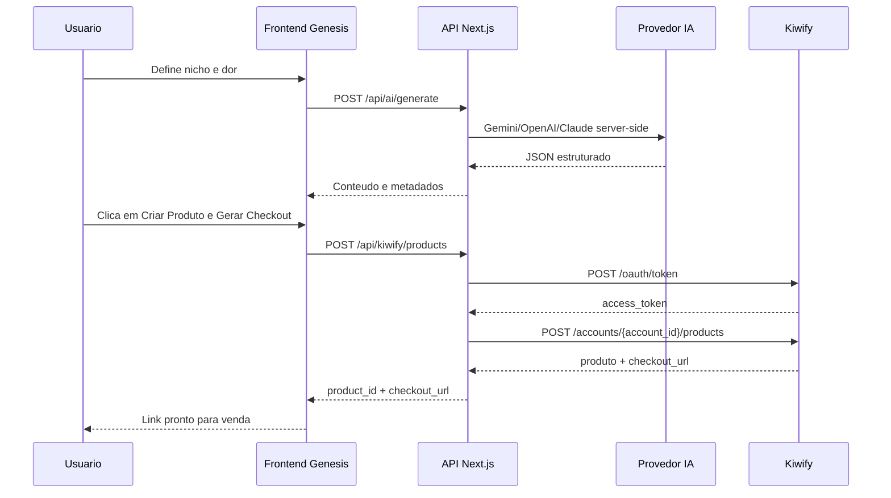

# Arquitetura - Genesis

## Componentes

Frontend Next.js:
- Shell com sidebar, Ferramentas, Configuracoes e Mapa Mental.
- Estado local para nicho, dor, produto gerado e resultado do checkout.
- Chamada de IA apenas para `/api/ai/generate`.
- Chamada apenas para `/api/kiwify/products`.

Backend Next.js API:
- Rota `POST /api/ai/generate`.
- Le o provedor de IA em `.env.local`.
- Usa Gemini como padrao e permite OpenAI/ChatGPT ou Claude por configuracao.
- Rota `POST /api/kiwify/products`.
- Le credenciais de `.env.local`.
- Pede token OAuth na Kiwify usando `client_credentials`.
- Cria produto na conta configurada.
- Devolve ao frontend apenas `product_id`, `checkout_url/link` e estado.

IA:
- Gemini: prioridade operacional para gerar e-book, prompts, produto, copy, grupos e scripts.
- OpenAI/ChatGPT: alternativa via `AI_PROVIDER=openai`.
- Claude: alternativa via `AI_PROVIDER=anthropic`.
- Nenhuma chave de IA e enviada ao browser.

Kiwify:
- Integracao server-to-server.
- Recebe payload com preco em centavos.
- Devolve identificador do produto e link de checkout quando disponivel.

Stripe futuro:
- Deve entrar como modulo paralelo, nao como substituto imediato da Kiwify.
- Prioridade para Portugal/Europa, cartoes internacionais, Apple Pay, Google Pay e assinaturas.

## Fluxo de dados



## Interface publica

`POST /api/ai/generate`

Entrada:

```json
{
  "module": "ebook",
  "context": {
    "nicho": "Marketing Digital",
    "dor": "Nao sabe criar uma oferta vendavel"
  },
  "options": {
    "format": "vertical"
  }
}
```

Saida de sucesso:

```json
{
  "ok": true,
  "text": "Resumo pronto para renderizar",
  "data": {
    "titulo": "Metodo Oferta Express",
    "precoEstimado": 47,
    "precoFinal": 47
  }
}
```

`POST /api/kiwify/products`

Entrada:

```json
{
  "name": "Metodo Fitness Express",
  "description": "Descricao curta do produto",
  "price": 47,
  "type": "ebook",
  "currency": "BRL"
}
```

Saida de sucesso:

```json
{
  "ok": true,
  "product_id": "prod_123",
  "checkout_url": "https://pay.kiwify.com.br/...",
  "link": "https://pay.kiwify.com.br/..."
}
```

Saida de erro:

```json
{
  "ok": false,
  "error": "Mensagem clara do erro"
}
```
