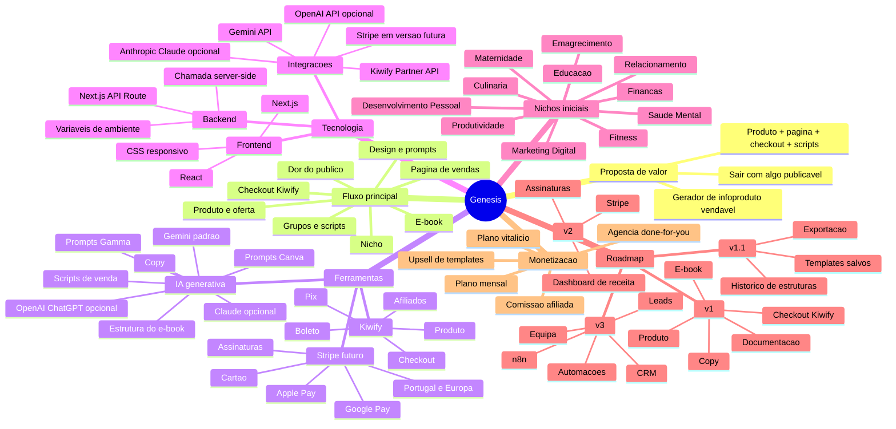

# Mapa Mental - Genesis

```mermaid
mindmap
  root((Genesis))
    Proposta de valor
      Gerador de infoproduto vendavel
      Produto + pagina + checkout + scripts
      Sair com algo publicavel
    Fluxo principal
      Nicho
      Dor do publico
      E-book
      Design e prompts
      Produto e oferta
      Pagina de vendas
      Grupos e scripts
      Checkout Kiwify
    Ferramentas
      IA generativa
        Gemini padrao
        OpenAI ChatGPT opcional
        Claude opcional
        Estrutura do e-book
        Copy
        Prompts Gamma
        Prompts Canva
        Scripts de venda
      Kiwify
        Produto
        Checkout
        Pix
        Boleto
        Afiliados
      Stripe futuro
        Portugal e Europa
        Cartao
        Apple Pay
        Google Pay
        Assinaturas
    Tecnologia
      Frontend
        Next.js
        React
        CSS responsivo
      Backend
        Next.js API Route
        Variaveis de ambiente
        Chamada server-side
      Integracoes
        Kiwify Partner API
        Gemini API
        OpenAI API opcional
        Anthropic Claude opcional
        Stripe em versao futura
    Nichos iniciais
      Emagrecimento
      Financas
      Relacionamento
      Marketing Digital
      Produtividade
      Saude Mental
      Culinaria
      Fitness
      Educacao
      Maternidade
      Desenvolvimento Pessoal
    Roadmap
      v1
        E-book
        Produto
        Copy
        Checkout Kiwify
        Documentacao
      v1.1
        Historico de estruturas
        Templates salvos
        Exportacao
      v2
        Stripe
        Assinaturas
        Dashboard de receita
      v3
        CRM
        Leads
        Automacoes
        n8n
        Equipa
    Monetizacao
      Plano mensal
      Plano vitalicio
      Upsell de templates
      Comissao afiliada
      Agencia done-for-you
```
